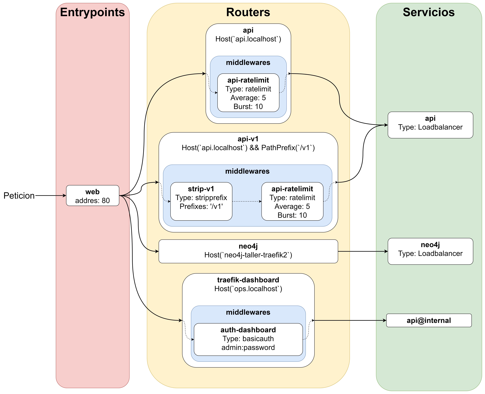
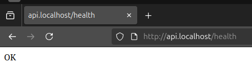
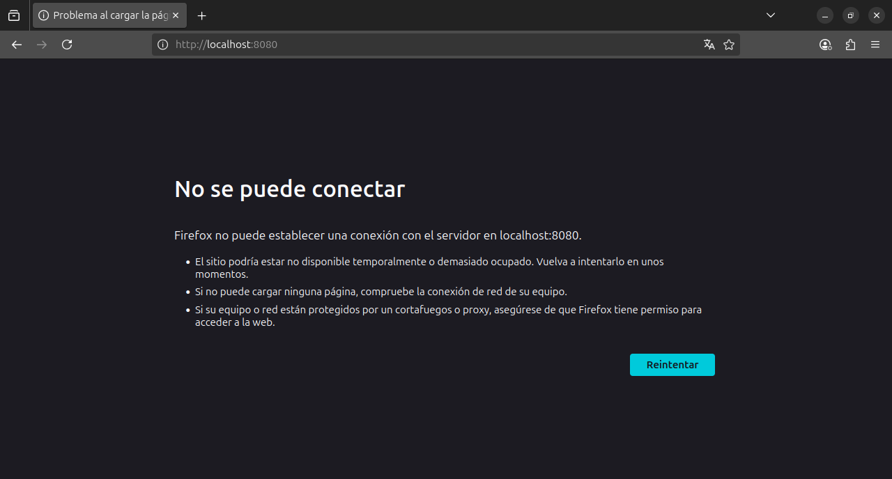
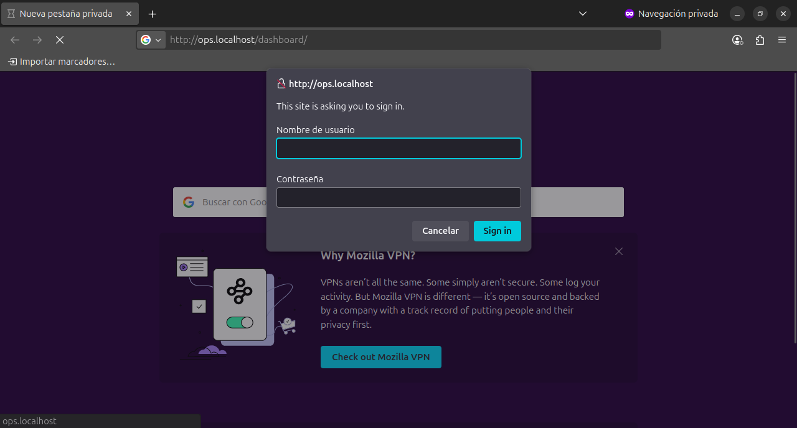
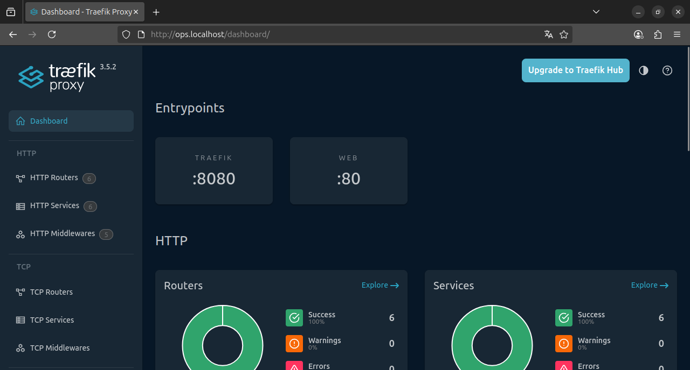
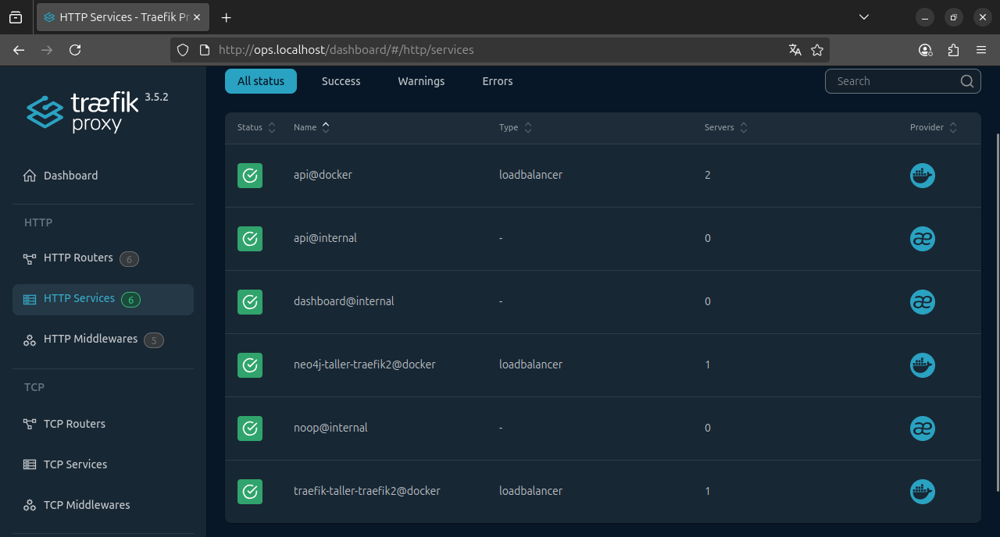
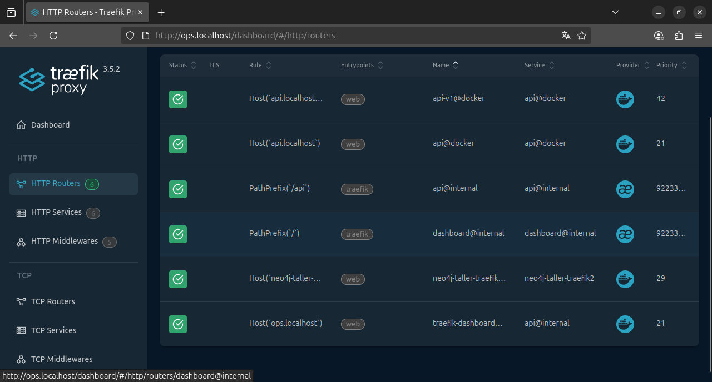
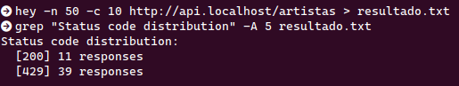
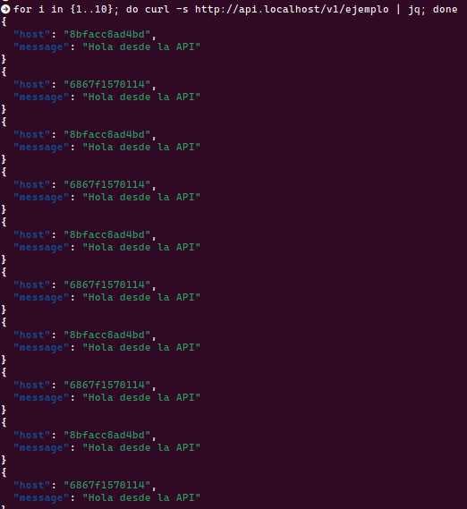

# Second Traefik Workshop

## Integrantes
- Walter Mauricio Alfonso Martinez
- Fabian Leonardo Correa Rojas

## Diagrama de la solución

## Hosts usados

- 127.0.0.1 api.localhost
- 127.0.0.1 ops.localhost

## Checklist de comprobaciones con resultados

###  API en api.localhost responde /health

### Dashboard  accesible  solo  en  ops.localhost/dashboard/  y  con auth

#### Dashboard no accesible desde la dirección default

#### Solicitud de autenticación por medio del middleware

#### Dashboard accesible desde ops.localhost

### Servicios y routers en el dashboard

#### Servicios

#### Routers

### Rate-limit aplicado y verificado

Haciendo uso de la libreria *hey*, se realiza múltiples peticiones, se muestra el codigo 429 (Too Many Request)

#### Balanceo

## Reflexión técnica

### ¿Qué aporta Traefik frente a mapear puertos directamente?

Mientrar que mapeando los puertos directamente implica hacerlo de forma manual, con Treafik es automático entre las replicas del servicio.

### ¿Qué middlewares usarían en producción y por qué? 

Implementaría RedirectScheme para forzar HTTPS, garantizando que el trafico de la comunicación este cifrado. Usaría RateLimit para prevenir ataques de denegación de servicio(DoS), limitando la cantidad de peticiones y aplicaría StripPrefix para una gestionar rutas.

### Riesgos de dejar el dashboard “abierto” y cómo mitigarlos

El dashboard expone información sensible como routers, servicios, middlewares y hostnames de los contenedores. Si se deja abierto, un atacante potencial podría mapear en detalle la arquitectura del sistema, identificando posibles puntos débiles y objetivos estratégicos. Este riesgo es significativo, ya que al reconocer vulnerabilidades se incrementa la probabilidad de explotación y acceso no autorizado al sistema, lo cual resulta especialmente crítico si se manejan bases de datos o información confidencial. Para reducir este riesgo, el dashboard nunca debe quedar expuesto públicamente. En su lugar, debe configurarse para ser accesible únicamente a través de un subdominio interno protegido con autenticación. Además, se recomienda restringir el acceso mediante un firewall, de modo que solo el personal autorizado pueda visualizarlo.

